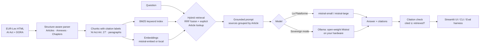

# EU AI Act & DORA Copilot

A retrieval-augmented assistant that answers questions about the **EU AI Act** (Regulation (EU) 2024/1689) and **DORA** (Regulation (EU) 2022/2554), with a citation to the exact Article or Annex for every claim. It runs on Mistral models, either through **La Plateforme** or **fully on your own machine** with open-weight models ("sovereign mode"). It comes with an **evaluation harness** that measures retrieval quality, citation accuracy, groundedness and refusals across models.

> Built for European financial-services teams who need to understand their AI and ICT-resilience obligations, and who shouldn't have to send regulatory questions to infrastructure outside their control to get answers.

## Why

European banks and insurers now sit under two major regulations at once. The AI Act governs how they build and use AI, and it treats credit scoring and life and health insurance pricing as high-risk. DORA governs their ICT risk, incident reporting and third-party providers. Compliance, risk and architecture teams ask questions that cut across both, and they need answers they can verify.

This project shows three things:

1. **Grounded, checkable answers.** Retrieval follows the structure of the law. Every answer cites Articles, and the app flags any citation that wasn't actually retrieved.
2. **Deployment choice.** The same pipeline runs on the hosted Mistral API or on a local open-weight model with nothing leaving the machine. That is the deployment model regulated European institutions increasingly need.
3. **Measured quality.** A golden set of 35 questions and a metrics harness compare models and modes, so choosing a model rests on evidence rather than vibes. Running a small model where it's good enough is also cheaper and lower-carbon.

## Architecture



| Component | File | Notes |
|---|---|---|
| Fetching | `regcopilot/fetch.py` | Gets the official texts from the EU Publications Office's Cellar repository, with fallbacks. Validates each candidate by parsing it, and records provenance (URL, SHA-256, date). |
| Ingestion | `regcopilot/ingest.py`, `parse.py` | Parses on text headings ("Article 27", "ANNEX III", "CHAPTER V"), not CSS classes, so it survives markup changes. Drops signatures and footnotes. |
| Chunking | `parse.py` | Chunks never cross Article boundaries. Long Articles split on numbered paragraphs, and each chunk carries its citation label and paragraph numbers. |
| Retrieval | `index.py`, `bm25.py` | BM25 + dense embeddings fused with Reciprocal Rank Fusion. Named references ("DORA Article 28") are looked up directly. |
| Generation | `rag.py`, `llm.py` | Strict grounding prompt with a fixed refusal sentence. One client interface for `mistral`, `ollama` and an offline `mock`. Plain HTTP, no SDK lock-in. |
| Evaluation | `eval/` | 32 in-scope and 3 out-of-scope questions with expected Articles and reference answers. Optional LLM-as-judge. |
| UI | `app.py` | Streamlit app with a hosted/sovereign toggle, a source viewer and links to EUR-Lex. |

## Quick start (macOS / Linux)

```bash
python3 -m venv .venv && source .venv/bin/activate
pip install -r requirements.txt
cp .env.example .env            # then add your MISTRAL_API_KEY

python tests/test_pipeline.py   # offline tests, no key needed

python -m regcopilot ingest     # fetches + parses both regulations into data/chunks.json
python eval/verify_golden.py    # checks the eval set against the ingested text
python -m regcopilot index --embed mistral

python -m regcopilot ask "Does an insurer pricing life cover with AI need a fundamental rights impact assessment?"
streamlit run app.py
```

**How the texts are fetched.** EUR-Lex's website blocks scripts with a bot check, so `regcopilot/fetch.py` gets the official texts from the EU Publications Office's **Cellar** repository, the machine-facing store behind EUR-Lex. It tries, in order: the exact English XHTML file on Cellar, Cellar content negotiation (CELEX number plus "English XHTML"), the EUR-Lex page itself, and finally any copy saved from a browser into `data/raw/` under any filename. A candidate is accepted only if it parses into the expected number of Articles, so a bot-check page can never be indexed by mistake. Each download is cached and recorded in `data/raw/manifest.json` with its URL, the route used, a SHA-256 hash and the date.

```bash
python -m regcopilot fetch --refresh -v   # show every route tried and which one worked
```

### Sovereign mode (everything local)

```bash
brew install ollama && ollama serve          # or see ollama.com for Linux
ollama pull mistral-nemo                     # open-weight Mistral model (or mistral-small for higher quality)
ollama pull nomic-embed-text                 # local embedding model
python -m regcopilot index --embed ollama
python -m regcopilot ask "What must ICT third-party contracts include under DORA?" --backend ollama
```

In the UI, pick **Sovereign mode**. Questions, documents and embeddings then never leave the machine.

## Evaluation

```bash
# Hosted: small vs large, judged by mistral-large
python eval/run_eval.py --backend mistral --models mistral-small-latest,mistral-large-latest --judge mistral-large-latest

# Sovereign: local model and local embeddings
python eval/run_eval.py --backend ollama --models mistral-nemo --embed ollama --judge mistral-large-latest

# Retrieval ablation: keyword-only vs hybrid
python eval/run_eval.py --backend mistral --embed none
```

| Metric | Meaning |
|---|---|
| hit@k | An expected Article/Annex was among the retrieved sources |
| MRR | How high the first correct source ranked |
| cited correctly | The answer cites at least one expected Article/Annex |
| grounded | Every citation refers to a source that was actually retrieved |
| false refusals / OOS refused | Declines answerable questions (bad) vs declines out-of-scope ones (good) |
| judge (1–5) | LLM-as-judge score against a hand-written reference answer |
| latency, tokens, cost | Cost appears once you fill in `prices.json` (see `prices.example.json`) |

### Results

Measured 9–11 October 2026 against the 35-question golden set (32 in-scope, 3 out-of-scope), k=6, judge = `mistral-large-latest` scoring 1–5 against hand-written reference answers. Costs are actual token counts at La Plateforme list prices (Mistral Small $0.15/$0.60, Mistral Large $0.50/$1.50 per million input/output tokens).
   model | backend | index | hit@6 % | MRR | cited correctly % | grounded % | false refusals % | OOS refused % | judge (1–5) | p50 latency s | cost ($) | per query ($) |
 |---|---|---|---|---|---|---|---|---|---|---|---|---|
 | mistral-small-latest | mistral | mistral (hybrid) | 93.8 | 0.938 | 90.6 | 100.0 | 0.0 | 100.0 | 4.81 | 1.47 | 0.015 | 0.0004 |
 | mistral-large-latest | mistral | mistral (hybrid) | 93.8 | 0.938 | 93.8 | 62.5 | 0.0 | 100.0 | 4.81 | 3.28 | 0.047 | 0.0013 |
 | mistral-small-latest | mistral | none (BM25) | 90.6 | 0.839 | 84.4 | 92.9 | 6.2 | 100.0 | 4.50 | 1.26 | 0.015 | 0.0004 |
 | mistral-large-latest | mistral | none (BM25) | 90.6 | 0.839 | 93.8 | 53.3 | 3.1 | 100.0 | 4.72 | 2.98 | 0.048 | 0.0014 |

**Reading the table.**

- **Hybrid retrieval earns its keep.** Hit@6 rises from 90.6% to 93.8% and false refusals fall from 6.2% to zero with both models — the embedding signal catches paraphrases BM25 misses, and the two signals never fight thanks to RRF fusion.
- **Small matches large on quality at a fraction of the cost.** Judge scores are identical (4.81 vs 4.81); `mistral-small-latest` runs at roughly twice the speed (p50 1.47s vs 3.28s) and about a third of the cost. With retrieval doing the heavy lifting, the smaller model is sufficient — cheaper, faster and lower-carbon.
- **Groundedness is the interesting failure mode.** Every citation from the small model traces to retrieved context (100% grounded). The large model, however, cites from memory in about four answers in ten (62.5% grounded) — most often padding answers with Article 113 (entry into force), which was never retrieved. For a regulated-domain assistant, a plausible citation with no retrieved evidence behind it is worse than a refusal, which is why the harness checks groundedness per answer rather than assuming it. Bigger models know more, and that is precisely the problem.

The Ollama (sovereign mode) row is pending; the hosted vs local comparison will be added once it has been run on target hardware.

## Design decisions

- **Structure over sliding windows.** Lawyers cite Articles, so retrieval units are Articles. That makes citations checkable and lets the eval score retrieval against a known right answer.
- **Hybrid retrieval.** Regulatory users type exact terms of art ("register of information", "TLPT"). BM25 catches those, embeddings catch paraphrases ("can my boss use AI to read my mood?"), and RRF combines them without tuning weights.
- **Refusal is a feature.** A fixed refusal sentence makes "I don't know" measurable. The out-of-scope questions check that the model doesn't answer GDPR questions from AI Act text.
- **Citation verification.** The answer is checked after generation: any citation that wasn't in the retrieved context is flagged as ungrounded.
- **Backend-agnostic, minimal dependencies.** Plain HTTP to La Plateforme and Ollama keeps the code easy to audit, which matters in regulated environments.

## Limitations

- Research prototype, **not legal advice**. Answers are only as good as the retrieved text and should be checked against the cited Articles.
- The corpus is the original published text of each regulation. Later amendments, delegated or implementing acts, regulatory technical standards and guidance (for example from the ESAs or the AI Office) are not included. Application dates may change through later legislation, so check EUR-Lex for the consolidated version.
- Reference answers in `eval/golden.jsonl` were written by hand from the regulations. `verify_golden.py` checks that each expected Article exists and contains a key phrase, but the references deserve expert review.
- Recitals are excluded by default (`--recitals` adds them). They help interpretation but can crowd out operative Articles in retrieval.

## Roadmap

- Multilingual: ingest the French and German texts, ask in one language and cite in another
- Add ESA/EBA/EIOPA guidelines and DORA RTS/ITS as a second tier of sources
- Re-ranking step and query rewriting for multi-hop questions ("an insurer using a third-party LLM for pricing")
- Fine-tune a small open-weight model on citation formatting and refusal behaviour, and compare it with prompting alone

## Sources

- [Regulation (EU) 2024/1689 (AI Act), EUR-Lex](https://eur-lex.europa.eu/eli/reg/2024/1689/oj)
- [Regulation (EU) 2022/2554 (DORA), EUR-Lex](https://eur-lex.europa.eu/eli/reg/2022/2554/oj)

© European Union, https://eur-lex.europa.eu. EU legal texts may be reused under the Commission's reuse policy.
